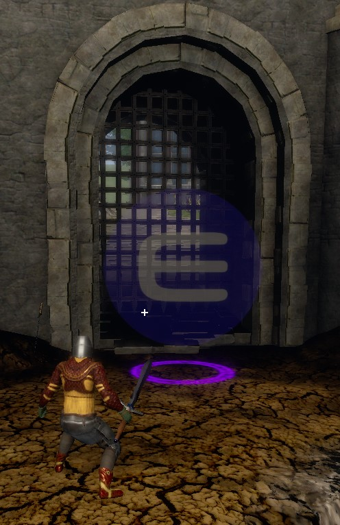
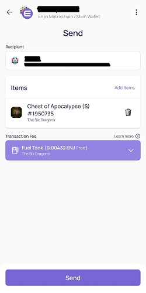
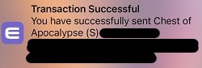

KC's Game Guides - Crafting Guide
==============

***Everything you need to know to about crafting in The Six Dragons***

**Author:** KC

- [KC's Game Guides - Crafting Guide](#kcs-game-guides---crafting-guide)
- [Introduction](#introduction)
- [Recipes, not patterns](#recipes-not-patterns)
- [Crafting An Off Chain Recipe](#crafting-an-off-chain-recipe)
- [A Tale of Two Wallets](#a-tale-of-two-wallets)
- [Moving any item from OC to BC](#moving-any-item-from-oc-to-bc)
- [Crafting A Blockchain Recipe](#crafting-a-blockchain-recipe)
- [Refined Items](#refined-items)
- [Enchants and Scrolls](#enchants-and-scrolls)
  - [Enchant Scrolls](#enchant-scrolls)
  - [Blessed Enchant Scrolls](#blessed-enchant-scrolls)
  - [Specialization Scrolls](#specialization-scrolls)
  - [Repair Toolkits](#repair-toolkits)
  - [Blockchain Enchanting](#blockchain-enchanting)
  - [Moving an item into the Game Wallet](#moving-an-item-into-the-game-wallet)
  - [Enchant or Specialize the item](#enchant-or-specialize-the-item)
- [Critical Crafts](#critical-crafts)
- [Item Trader](#item-trader)
- [Listing A Recipe on The Blacksmith](#listing-a-recipe-on-the-blacksmith)
- [Cooking](#cooking)

# Introduction

Crafting is often a complex topic in gaming, but it gets even more complex when you add the crypto element. Crypto and NFT's are also what makes this game unique and creates the potential to be profitable for the crypto gamer. At a minimum you have the opportunity to earn back much of your initial investment, as you can always sell the items you purchased when you are finished with them. For the dedicated crafter, the potential for earning is much greater. 

Creating, selling and trading NFT's is one of the primary components of crypto gaming. The game itself, while fun and entertaining, isn't nearly as complex as the non-crypto competitors in the fantasy genre. It's really the crypto aspect that sets this game apart and brings a different level of challenge and entertainment to the gamer. This guide will tell you everything you need to know to master the basics of crafting in The Six Dragons.

[Back to top](#kcs-game-guides---crafting-guide)

# Recipes, not patterns

Before you start crafting, be sure you have a recipe and the necessary materials. People often get recipes confused with patterns. 

Patterns are one of many materials required to craft an item. However, you can’t craft anything until you have a **recipe** which lists all the materials needed to craft the item.  Recipe drops are extremely rare.

Patterns on the other hand are an extremely common drop. This is good because all the recipes require multiple patterns for each use.

Recipes are not unique. If you loot a recipe for level 1 uncommon cotton leggings, you can be sure several other players have looted the same recipe. 
There are several ways to get a recipe. 
1. You can loot one.
2. You can buy one at the in-game multiplayer marketplace.
3. You can buy one from a site that brokers NFT's like Enjin's [nft.io](https://nft.io). 
4. You can pay to rent a recipe from another player for a single time use.

[Back to top](#kcs-game-guides---crafting-guide)

# Crafting An Off Chain Recipe
A basic OC craft isn't very complex. There is even a quest in the town of Aligren that will help you get started. I recommend you do this quest as the item you craft will be better than the one you start out with. The quest is nice because you get a single use recipe and you don't have to wait until you loot or buy a recipe. 
The basic steps are as follows:
1. Get a recipe.
2. Gather the necessary materials.
3. Go to the the Blacksmith's Forge in any town and use it by pressing "F".

4. Select the recipe you want to craft. The game will confirm you have the necessary materials. If you don't have enough of any ingredient, it will show as red and not green.

5. Click the "Create" button. When the craft is complete the item will be in your inventory.

At this point you have an off chain (OC) item. OC items have some downsides you should be aware of. 
-  If you equip this item, it will become bound to you and will suffer from decay and eventually require being repaired.
-  Once the item is bound it can never be transferred to another player.
  
There are also some benefits to OC items
- They can be sold to other players on the in-game multiplayer marketplace.
- They can be enchanted and have specializations added at no cost, as long as you have the enchant scrolls.
- They are basically free. Assuming you looted a recipe and looted the necessary materials, the actual craft doesn't cost anything.

When you craft an OC item, it ends up in your game wallet. This is important, so read more about this in the next section.

[Back to top](#kcs-game-guides---crafting-guide)

# A Tale of Two Wallets

**A little bit of explanation is required here, so bear with me. This is very important, so please pay attention and reread this until you fully understand it.**

There are 2 wallets in the game, the Game Wallet and your personal wallet. Your personal wallet is your Enjin wallet. This is the one where you can view your NFT's on your phone or on nft.io.

Both the Game Wallet and the personal wallet synchronize to your inventory in the game. So, if you can see an item in your inventory, you might believe it's in your game wallet, but that's not necessarily true. An item can only exist in one place. When you see an item in your inventory it only exists in one of these 3 places:
- OC meaning the item only exists inside the game and resides in your inventory.
- Game Wallet
- Personal Wallet

If you can see an item in your personal wallet, then that is the only place where the item exists. At this point the item is locked on the chain and the attributes can't be changed. Before it can be modified it must be moved somewhere the game has the ability to change the attributes. That's where your Game Wallet comes in. 

Remember earlier when I said OC crafted items land in your Game Wallet? While an item is in your Game Wallet, the game has permission to modify it. Technically the item gets destroyed and recreated with new attributes. Once the modifications are complete, you'll want to move the item back to your personal wallet where the item's attributes are locked again.

The game wallet is a transitory space. It's more of a temporary holding area rather than a final destination. In general items will either be OC and only exist in your inventory, or they will be BC and stored in your personal wallet. The only time you will have items in your game wallet is when you want to modify them. That's not to say you couldn't have items in your game wallet for long periods of time as this is possible. But, when you use the option to transfer NFT's to your personal wallet, anything in the game wallet will get moved out. 

# Moving any item from OC to BC

**SECTION NEEDS TO BE REWORKED**
If you want to sell a recipe or list it on the Blacksmith, you must first move it from OC to BC. This same basic process applies to moving any item from OC to BC, with minor variations that should be self-evident. The one big thing to note is the fees for moving a recipe from OC to BC are paid in JENJ. The fees to move armor and weapons is paid in TSDT. Remember, TSDT has a value of 100 TSDT:1 JENJ.
1.	Find the Celestial Shop vendor and press “F”.
 
 
2.	Select “OC -> BC Equipment Trader”.
 

3.	Select “OC Recipes to BC”.
 

 
4.	Select the recipe you want to move to BC.
 

5.	Choose the amount you want to move. Typically, this will be one.
 

 
6.	Acknowledge the trade cost by validating you have enough TSDT to cover the cost and then selecting “Accept”. The fee to move a recipe is usually cheap. This screen capture was from a level 2 mace I moved, so that cost a little more.
 

7.	You will see a message telling you to accept the trade in your Enjin Wallet.
 
8.	Using your phone, open the Enjin wallet application. From the main menu select requests. Select “Confirm Create Trade” and enter your password when prompted. Be sure to do this before proceeding to the next step in the game. If you click Proceed in the game first and are not fast enough to approve the trade request in Enjin, the game will prompt you to approve the trade before it advances to the next step.
 

9.	In the game, select “Proceed” to move forward with the trade. You will see a confirmation message saying the trade is in progress. 
10.	The game says the trade will complete within 2 minutes. I have had it take quite a bit longer (20 minutes +). Be patient. Once the trade is complete you will get a confirmation on your phone and the item will show up as a BC asset.
11.	The recipe is still in your in-game inventory, but now it also shows up in your Enjin Wallet as an asset.

[Back to top](#kcs-game-guides---crafting-guide)

# Crafting A Blockchain Recipe

You have the option of crafting an item directly to the blockchain. When the item is created, you can choose to directly list it for sale, or you can use it in game once you sync your wallet. While crafting OC is free, BC crafting is not. You have to pay a fee to mint the item on the blockchain, just as you would if you crafted the item OC and then later wanted to move it from OC to BC. Remember, you always have to pay when an item is added to the blockchain.
BC crafting uses OC mats. You don't have to move the mats to BC first. The mats will be consumed from your inventory and destroyed in the crafting process.

BC crafting can't be down at the Blacksmith's forge in town. You'll need to travel to Enjinville, which is just North of Aligren. 

In Enjinville you will find a Blacksmith's Forge similar to the one in each town but with some extra options. 

1. Press "F" to use the forge and you will see the following screen.

2. Select the Crafting Station option and then select the desired recipe from your list of available recipes. Confirm you have the necessary ingredients and click Create. At this point you'll be reminded there is a fee for BC crafting and to be sure you have enough funds in your wallet to pay for it. As long as you have the funds, select Proceed.

3. The crafting will start and the materials will be removed from your wallet. Before the crafting process can finish you will have to pay the bill. You will be told how much the transaction will cost and be shown the breakdown of fees. Select Proceed to mint your item to the blockchain.

4. The minting process will begin. You will see a message when this is complete and you will also see the item was added to your inventory in the combat log. 

If I examine the item in my inventory, it will show the all important "BC" designator in the lower right corner.

At this point your BC craft is complete.

[Back to top](#kcs-game-guides---crafting-guide)

# Refined Items
Many of the recipes require refined items. These include things like thread, sacred thread, bark, sacred bark, healing herbs and blue lotus flower.

In order to refine these, you need to collect the appropriate resources and then visit the refining station in one of the towns. 

Everything requires plants or perfect plants except the bark. Bark requires wood and sacred bark requires perfect wood. In addition to the required materials, you must pay a fee in gold to craft these items. 

[Back to top](#kcs-game-guides---crafting-guide)

# Enchants and Scrolls

## Enchant Scrolls

As you collect loot you will also begin to gather enchant scrolls. Weapons and armor each have their own scrolls and the scroll has to match the item you want to enchant. So, if you have a level 3 sword, you need a level 3 weapon enchant. Using the enchant scroll on the weapon will slightly increase the stats. 

Items can be enchanted more than once. In fact, you can enchant an item up to +15. **Be very careful here!** Standard scrolls have a 100% chance to succeed up to +3. After +4 there is only a 66% chance of success. If the enchant fails, you lose the item. 

You can use an enchant scroll from anywhere. You don't need to be near a crafting station or any other item.

## Blessed Enchant Scrolls

The blessed enchant scroll is an extremely rare item. Blessed enchant scrolls have a 100% chance to succeed all the way up to +15. They exist in the game, but as of this version of the guide I'm not sure how you get them except by buying them from other players. I believe these were purchased as part of the game's pre-sale.

## Specialization Scrolls

Another type of enchant scroll is a the armor specialization scroll. This will modify the stats of an armor piece in favor of either a wizard or a warrior depending on the scroll. There is also an armor specialization remove scroll, so if you buy a great armor piece that is enchanted for a wizard, you can use the remove scroll to remove the specialization enchant and then use a warrior specialization scroll. 

    

## Repair Toolkits

If you bind an OC item it will begin to suffer decay. Eventually the item will break and become unusable until you repair it. **NOTE - This can happen in the middle of a fight, in which case the item get's unequipped, which can be really bad!**

To repair the item you need to use a repair toolkit. OK, I know these aren't technically scrolls, but they look very similar to the enchant scrolls and they land very near them in your inventory, so I lumped them in here. 

There are armor repair toolkits and weapon repair toolkits. You need to use the appropriate level and type of toolkit. You'll also be required to provide some kind of crafting material. For instance, if you are repairing a level 3 rare chest piece, you will need a level 3 armor repair toolkit and you will propably also need a level 3 rare matter. The matter will be consumed during the repair process and the item will be restored to 100%.

## Blockchain Enchanting

Everything I've told you so far works great as long as the item is OC or in your Game Wallet. Keep this in mind when you are crafting. Whenever possible you probably want to apply enchants and specializations before you move the item to BC. 

You can still enchant and modify the specialization for BC items (repair is obviously not necessary) at a station in Enjinville. A few extra steps are required first. 

Pop quiz time! If you have an item that is BC, which wallet is this in? If you said your personal wallet, you are 100% correct. If you missed this, go back and reread [a tale of two wallets](#a-tale-of-two-wallets). You'll thank me later.

Since the item is in your personal wallet the attributes are locked and it can't be changed. We need to move the item to your Game Wallet first. 

## Moving an item into the Game Wallet

1. Press "M" to open the menu.

2. Press "W" to open your wallet. Your QR code will be displayed for your Game Wallet.

3. Using your phone, open your Enjin wallet. Find the NFT you want to encant or modify.

4. Send the item to the QR code of your Game Wallet.

5. Enjin will display the fees for the item transfer. While creating this document there was a promo that paid the cost, so my transfer was free. Yay me! Confirm the fees and press "Send".

6. Once the transfer is successful you will get a confirmation. 

At this point the item is no longer visible in your personal wallet because it's been moved to the Game Wallet. 

## Enchant or Specialize the item
If you're not there already, you need to get to the BC Enchanting station in Enjinville.

The process is the same for either enchants or specializations.

1. Press "F" to interact with the station. In this case you are interacting with the table.

2. Select the scroll you wish to use. In this example I'm using a level 2 armor enchant.
3. Acknowledge the message the BC item must be in your game wallet.

4. Acknowledge the message the item must be unequipped, etc.

5. 

[Back to top](#kcs-game-guides---crafting-guide)

# Critical Crafts

While you are crafting, you have the opportunity for a critical craft. This means the item crafted will jump up to the next higher rarity with better than normal stats, and it will have the (S) designation at the end of the name. The S stands for a superior craft.

As an example, I crafted a level 2 Chest of Apocalypse, which would normally be EPIC in rarity. Because I got a critical craft, the same level 2 items is now LEGENDARY in rarity and has better stats than it's epic counterparts.

This begs the question, what happens on a critical craft for a legendary recipe? After all, legendary is the highest level. Well, not quite. There is one level higher which is the most rare of all...DRAGONFORGED! There are no dragonforged recipes. The only way to get a dragonforged item is as a loot drop, as a result of a critical craft, or of course, you can buy one. As an example, I got a critical craft on this level 2 Dellusion mace, which resulted in a dragonforged weapon. 

Critical crafts are quite rare, but they are a happy surprise when one happens! If you are the proud owner of an SFT, then you have an improved chance that each craft will result in a critical craft.
 
[Back to top](#kcs-game-guides---crafting-guide)

# Item Trader
 As you're crafting you will inevitably find yourself short of one item or another. Let's assume you ran out of level 1 metal because you are already mining level 2 metal. But you need level 1 metal to craft that mace for your friend. The Item Trader is here to save the day!

The item trader will allow you to trade certain items between levels. In our example you needed level 1 metal, but you have extra level 2 metal. For a fee the trader will give you 2 level 1 metal for every 1 level 2 metal you trade to them. If you trade them 1000 level 2 metal you will get 2000 level 1 metal. Trades work the other way also. If you trade 1000 level 2 metal for level 3 then you will only 500 level 3 metal. 

You can do this with many things like metal, wood, plant, matter, gems, essence, dungeon keys and arena crystals. You can also do this with refined items. However, you can't do this with patterns or enchant scrolls. 

[Back to top](#kcs-game-guides---crafting-guide)
 
# Listing A Recipe on The Blacksmith

One of the big advantages of recipes in TSD is the ability to rent them out to other players. You can let other players use your recipe for a fee so they can craft their own item. The person renting the recipe must pay the fee and provide their own materials, but they receive the crafted item. If they wanted to craft a second item, they would need to pay the fee again and would need another set of materials.

You can continue to use your own recipe at no fee while it is listed on the blacksmith. You keep a portion of the fee paid by other players, but the game also takes a portion which goes to support the game. 

There are limits on the blacksmith service based on your crafting level. Your level controls 3 things:
1.	How many recipes you can list on the blacksmith at one time.
2.	How many changes you can make to your blacksmith listings each day.
3.	How many times you can rent your recipes each day.

Let’s talk about these one at a time. The first limitation is how many recipes you can have listed on the blacksmith. Maybe you have 10 recipes in your inventory, but if your blacksmith level is low, you will only be able to list a few at one time. Let’s say you are capped at four listings. Now you must choose which four recipes are most likely to be used by other players. If you want to list more recipes, you need to craft more items and raise your blacksmith skill level.

The next limitation is how many changes you can make to your listings each day. Changes include things like changing the price you want to charge other players, but also include removing and adding recipes. If you are capped at four recipes, but only have 3 listed, then the blacksmith will allow you to swap an unlisted recipe for a listed recipe all in one step which counts as one change. However, if you have four listings active, then you must remove the old listing first, and then add your new recipe in a separate step. This still counts as one change, even though you must perform it in two steps. 

The final limitation is how many times each day your recipes can be used by other players. If your current limitation is four items per day, then other players can rent your recipes 4 times and craft four items. After that, no one else will be able to rent a recipe from you until the next day. If you want to rent more recipes per day, you need to raise your blacksmith level.

There is no limitation on how much you can craft each day using your own recipes. If you have the materials, craft away!
 
Before you can rent out a recipe, you need to move it from OC to BC. We discussed how to do this in the section [earlier in this guide](#moving-any-item-from-oc-to-bc). Once your BC recipe is ready to list, use the following instructions to make it available to other players.
1.	At the forge press “F”.
2.	Select “Blockchain Blacksmith’s Market”.
3.	Select “Add Recipe Listing”.
4.	Select “Accept” to acknowledge the recipe you want to rent out is BC.
5.	Select the recipe you want to list.
6.	Select the fee for using your recipe. The white bar is a slider, so to increase the amount use the mouse to slide the bar to the right until your price is set. The select “Accept”.
7.	Once the listing is complete you will see a confirmation message.
 
[Back to top](#kcs-game-guides---crafting-guide)

# Cooking

In addition to crafting, you can collect and cook resources to create buffs. Unlike crafting armor, weapons, and jewelry you don’t need a recipe, so everyone can cook if you have the necessary resources. There are 4 types of buffs you can create.
1.	Cooked Meat (requires 10 raw meat). +3% to STR, INT, and ACC for 10 minutes when consumed.
2.	Cooked Mushroom (requires 10 mushrooms). +3% to DEF and M. DEF for 10 minutes when consumed.
3.	Brew Stew (requires 3 perfect plants and 1 mushroom). +3% to EXP for 10 minutes when consumed.
4.  Cooked Fish (requires 10 of the same level fish). Cooked fish increases your stats more and longer as the rarity of the fish increases. Regular old cooked fish increases your stats marginally for 10 minutes, where as legendary cooked fish increases your stats much more and last for 20 minutes.

These bonuses stack, so you could consume all several or all of the buffs at once to get all the bonuses. 

You get raw meat by killing wild animals such as boar, deer, and rabbits. You harvest mushrooms wherever you find them. I explain how to fish in the New Player Guide.

When you have the necessary resources to make your buffs, head to town and find the campfire. You need 15 wood resources to light a fire. The fires are single use, so you need 15 wood resources for each buff you want to cook. Once you start the fire, the menu appears, and you select which item you want to cook. If you have the necessary ingredients, the cooking process will start. When it is complete, you will be able to loot the cooked item. 

[Back to top](#kcs-game-guides---crafting-guide)