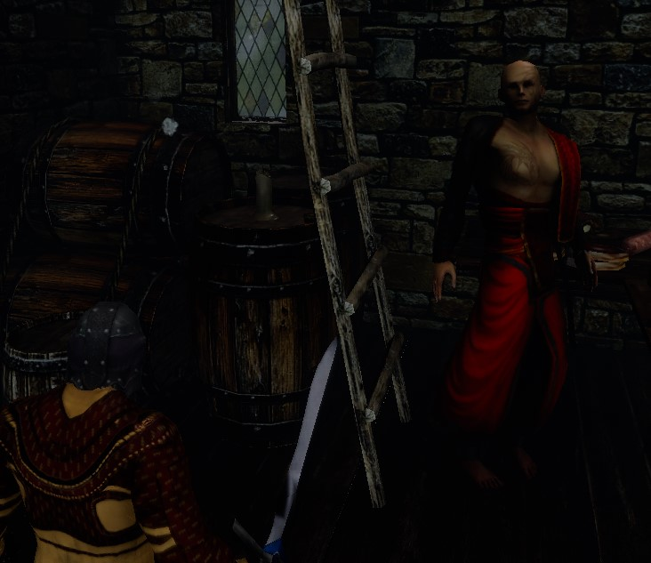
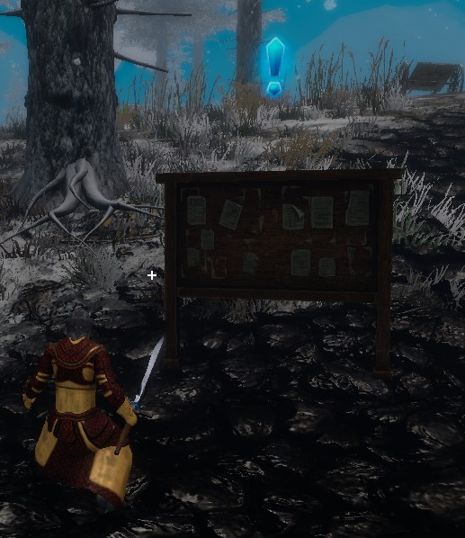
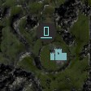
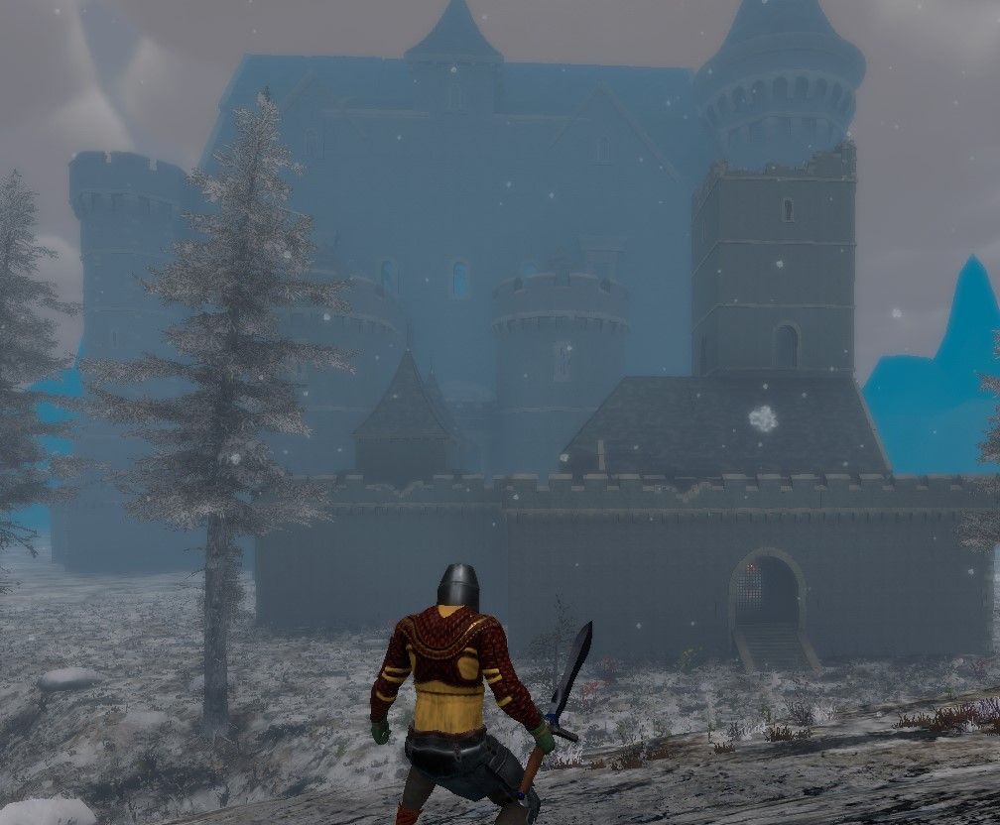
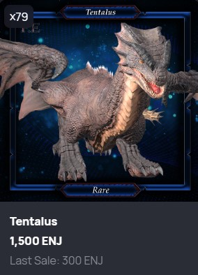

KC's Game Guides - New Player Guide - Start Here!
==============

***Everything you need to know to start playing The Six Dragons***

**Author:** KC
 
- [KC's Game Guides - New Player Guide - Start Here!](#kcs-game-guides---new-player-guide---start-here)
- [Introduction](#introduction)
- [Welcome to Nemberus!](#welcome-to-nemberus)
- [Daily Quests](#daily-quests)
- [Where is everybody?](#where-is-everybody)
- [Open World Bosses](#open-world-bosses)
- [Dragons!](#dragons)
- [Dragon Mounts!](#dragon-mounts)
- [Arenas/Dungeons](#arenasdungeons)
  - [Dungeons](#dungeons)
  - [Arenas](#arenas)
- [Tents](#tents)
- [OC (off chain) vs. BC (blockchain)](#oc-off-chain-vs-bc-blockchain)
- [Free To Play](#free-to-play)
- [Have some class!](#have-some-class)
- [Player Attributes](#player-attributes)
- [Crafting basics](#crafting-basics)
- [Fishing](#fishing)
- [Summary](#summary)
- [Additional Reading](#additional-reading)

# Introduction

This is a guide for people just starting to play The Six Dragons. Much of this is available elsewhere, and a lot of it I just figured out by playing. **If you prefer to learn by exploring, some of this might be considered “spoiler” material, so read at your own risk.**

This is a very exciting time in the history of the game. After 5 years of development the game has now reached the production release. Even so, this is a new game and you may still find bugs. When you see a bug, report it in-game by pressing F7. Alternatively, you can report the bug in the bug-reporting section on [Discord](http://discord.com) when using F7 is not possible (such as when the game crashes, etc.)

Speaking of [Discord](http://discord.com), there is no mechanism for communicating with other players in the game, so I strongly recommend installing [Discord](http://discord.com) and joining [The Six Dragons channel](https://discord.com/channels/568545477415534643/572371055235039264). This is the place to get the latest news and also ask questions.

If you want a brief history of how the game got started, I highly recommend this article from the founder and CEO, Savas Lazopoulos (SL in Discord).

[The Six Dragons: Integrating Blockchain in 48 Hours](https://enjin.io/blog/the-six-dragons-blockchain-integration)

I hope you find this guide helpful.

[Back to top](#kcs-game-guides---new-player-guide---start-here)

# Welcome to Nemberus!
You just landed in Nemberus…now what? Before you start playing, you need to know a few things. First, you are mostly naked, but you do have a level 1 weapon and some basic armor. One of the first things you want to do is get some additional armor pieces. Armor can be purchased from a vendor in the first town.

From where you first land in the game, you want to follow the road to Aligren. As you move, you will be attacked by spiders and skeletons, so be sure you understand the basic controls and how to fight. You can get to the menu by pressing “M”.

As soon as possible, go to the vendor in town and buy all the level 1 armor pieces. You may not be able to afford all of them right away so buy what you can and then fight the creatures outside of town until you can afford them all.

Remember, you will keep this armor until you hit level 10, at which point you want to buy the level 2 armor. You will loot health and mana potions as you fight, and you can buy these from other players on the marketplace, but these aren’t cheap so try to use them sparingly. I recommend learning a healing spell early on. If you take your time moving through the world and the dungeons, you should be able to keep the fights to less than 3 or 4 monsters at a time.

While we are talking about vendors, the vendor offerings are the same in each town, so there is no reason to kill yourself getting to the second town. As you progress, the vendor will offer you higher level armor and equipment. When you get to level 10 you will be able to buy level 2 armor and weapons. The vendor will offer you better gear every ten levels.
That brings me to the topic of money. In the game you can buy things from the vendor for gold. You get gold in 2 ways, by killing the monsters or by selling items to other players on the multiplayer marketplace. When you kill a monster, you get a small amount of gold. You also have a chance to loot additional items such as leather, gems and keys that will get you into the arenas and dungeons.

As you move around the map keep an eye out for resources you can harvest. 

The big rocks can be mined for metal. The trees can be harvested for wood. There are certain plants that can be harvested for, well, plants. You harvest these by standing very close and pressing “F”. If you are lucky, you will get a perfect item which is used for higher quality crafting. You can see your gold and other items in your inventory by pressing “I”.

In addition to resources gathered for crafting, there are resources gathered to make buffs. Be on the lookout for wild game such as boar, deer, and rabbits. These won't attack you, but if you kill these, you can loot raw meat. You should also look for mushrooms you can gather.

The mushrooms and raw meat can be cooked in town to make buffs. When you consume these buffs, you get a boost to a specific stat for a short period of time. You’ll need wood resources to build a fire, and you need to build a new fire for each item you want to cook, so be sure to chop lots of trees during your travels if you plan on crafting buffs. You can read more about the different buffs and how to make them in the crafting guide.

Pay attention to what area you are in. This is visible in the upper right corner. The starting area is level 1-5. There is no visible boundary between the difficulty areas, so it's very easy to get into the next level area which is 6-10. These will be too tough for you until you level up, so stay in the 1-5 area for now.
When you eventually die, you will be teleported back to Aligren. There is no penalty for dying. You just get teleported back to town.

[Back to top](#kcs-game-guides---new-player-guide---start-here)

# Daily Quests

In every town you will find a green glowing doorway or portal. Very close to that is a bulletin board where you can take daily quests. The quest options are limited right now, but you will be killing a bunch of monsters anyway, so you might as well get the rewards. Completing quests will earn you quest relics. There is a vendor in town where these can be exchanged for materials, enchants, arena crystals, portal keys and consumables.

Be sure to stand close to the portal so that you save it as a location. As you travel through the world you will find light blue portals. You want to stand on each of these that you find to unlock them also. Once they are unlocked, you can use them to quickly move to any other portal. You can also use them to travel to a location where you’ve setup a camp with a tent, but we’ll discuss those more later.

[Back to top](#kcs-game-guides---new-player-guide---start-here)

# Where is everybody?
The Six Dragons will eventually be a multi-player game, but for now it is single player only.

[Back to top](#kcs-game-guides---new-player-guide---start-here)

# Open World Bosses
Now, let’s talk about the Root King. 

This is one of the daily quests for players between level 1 and 10, but for this quest you must kill a boss. The location of the world bosses is noted on the map with an oversized skull. 

Some of the creatures near the world bosses are elite level and will be much harder to kill than normal creatures so be ready.

The Root King can be a tough fight, so kill all the monsters near him first. Don’t stand in the fire! Move around while you are fighting him.
The world boss changes every 10 levels. At level 11-20 you will be looking for a griffin type boss called Scogriff. I'll leave the remaining bosses as a mystery for you to discover on your own.

[Back to top](#kcs-game-guides---new-player-guide---start-here)

# Dragons!

The game is called The Six Dragons, so you guessed it, there are six dragons to fight. As you advance through the game you will have the opportunity to fight a different dragon for every 10 levels you advance. The first dragon you will encounter is Tentalus. I don't want to give too much away, so you will find out more about the other dragons as you advance. Each dragon lives in it's own castle. You can find them by looking for the castle icon on the map. 

You take the quest from the daily quest board, but the quest to kill the dragon only resets every Tuesday and Friday, meaning you can only complete this quest twice each week. 

This is a quest worth doing. If you can't complete the quest on Tuesday or Friday then don't worry. Once the dragons spawn, the quest can be completed anytime before the next reset. In addition to a challenging fight, the dragons can drop some very nice loot and you earn a dragon's soul everytime you kill one. These can be exchanged for items from a vendor in town. 

[Back to top](#kcs-game-guides---new-player-guide---start-here)

# Dragon Mounts!

You may find you get tired of running around being chased by spiders and skeletons. I have good news! For a fee you can purchase one or more of the dragons and use them as a winged mount! These are not loot drops and they can't be crafted. The only way to get a mount is from the TSD store or from another player. There are almost always dragons for sale on the nft.io marketplace. However, don't expect them to come cheap. Tentalus is the most common, has the lowest maximum ceiling and flies the slowest. Don't let that keep you from buying one if it's the only one in your budget. Tentalus is still much faster than running. Flying in this game is a huge advantage and it's a lot of fun.

If your wallet is a little fatter, the dragons become more rare and fly higher and faster as you move up the ladder. You should expect the cost to increase with these added benefits. Nagaroth, the tier 6 dragon is the most rare, highest flying and fastest dragon you can buy. As I write this only 44 have been minted.

[Back to top](#kcs-game-guides---new-player-guide---start-here)

# Arenas/Dungeons
Now the grind begins. Go a short distance from the town until you begin seeing monsters (spiders, skeletons, etc.) and kill them. This generates experience and gold. You need to keep doing this until you get an arena crystal or a dungeon key. 

As you roam the map, you will see some big floating rings and some platforms you can stand on.

 arena entrance")

 dungeon entrance")

The platforms are the entry to arenas and the rings are the entry to dungeons. These are color coded as follows:

GREEN – UNCOMMMON \
BLUE – RARE \
PURPLE – EPIC \
YELLOW – LEGENDARY

A green arena crystal will get you into a green arena. A green dungeon key will get you into a green dungeon. As you loot crystals and keys, use these to access arenas and dungeons of the same color. The arena and dungeon portals are scattered all around the map, so just explore and you will find them. Also, the locations of the arenas and portals move every time you log in and often when you teleport, so you must hunt down the current location of an arena or dungeon that matches the crystals and keys you have on hand.

The difficulty of the monsters inside doesn’t change depending on the arena/dungeon type, but the better-quality arenas/dungeons have a higher chance of dropping better loot. The bosses don’t always drop loot, so as disappointing as it is, don’t be surprised if there is no reward after killing one.

## Dungeons

When you enter a dungeon you will have to choose from one of 3 doors. The green door is the easy path, the yellow door is more difficult, and the red door is the most difficult. Choose wisely, as once you enter a path it locks behind you and the only way out is success...or death. I recommend the easy path when you first start out. As you level up and get better gear you will be able to take the more difficult paths. 

Each dungeon has a mini boss called the Troll guard. You need to find and kill him to unlock the gate to the main boss. There is a quest given at the beginning of a dungeon and when you kill the main boss you get a quest relic which can be traded at the vendor in town. 

Dungeons are a great place to find a lot of monsters that count toward your daily quests as well as earn experience and gold coins. The more things you kill, the greater your chance to loot OC items. Also, you will find gold and purple ore scattered through the dungeon. These are valuable crafting items and can only be found in the dungeons. Dungeon keys are hard to come by, especially as your experience level goes up, so strip those dungeons clean!

## Arenas

Arenas are quick. There is one boss in a room which you need to kill. Once you are done, you use the portal to leave the arena. There is no quest and no other monsters. 

[Back to top](#kcs-game-guides---new-player-guide---start-here)

# Tents

This is a good time to talk about tents. You can buy tents from the vendor in town. The cheapest one is Red and costs 100,000 gold. You can put your tent someplace far from town and use any portal to instantly jump to it. The tent will stay where you put it until you pick it up again. It even stays put when you exit the game. You can also use your camp to make buffs.

[Back to top](#kcs-game-guides---new-player-guide---start-here)

# OC (off chain) vs. BC (blockchain)
“Wait, you said something about looting OC items. What are those?” You are full of great questions! One feature that makes TSD so great is that it’s a blockchain game. This means that many of the best items in the game can be moved out of the game and sold to other players. Or you can buy items from other players and bring them into the game. OC stands for off chain. OC items are rare drops like weapons, armor and crafting recipes. These items will have a bold border when viewed in your inventory.

While an item exists off chain, it can only exist inside the game. Let’s assume you loot an Uncommon (green) chest piece. It will have better stats than the common armor, so it’s advisable to use it. However, you might want to do some planning first. If you just equip the armor piece it will become bound to you. Also, OC items incur wear as they are used and will eventually need to be repaired. Alternatively, if you don’t equip the item and you leave it unbound, then you can sell it to another player on the multiplayer marketplace.

There is a 3rd option, which is to move the item to the blockchain. Items on the blockchain are referred to as BC items. They can’t be bound, they don’t decay and they can always be bought or sold to other players. Moving an item to BC is not free. You need to pay a fee to move items between from OC to BC. There is a station in a town called Enjin Ville that will help you facilitate this transaction. If you want a better understanding of crypto currency as it relates to the game, be sure to read my Game Economy Guide for more information.

[Back to top](#kcs-game-guides---new-player-guide---start-here)

# Free To Play

The Six Dragons is a free to play game. You don't have to purchase the game or buy a subscription to play. But, of course there are incentives to spending a little money. The most difficult way to play TSD is completely for free. You will have the lowest chance of getting good loot drops, the lowest chance of a critical craft and earn XP at the slowest rate. You can buy a 30 day subscription which provides you with extra benefits. There is also an option to purchase a lifetime VIP membership for a flat fee that will ensure you always have these extra benefits. Oh, and guess what? The lifetime VIP membership is an NFT meaning it is fully transferable and can be sold to other players if you decide you don't want it anymore!

If you're wondering if you can play the game for free, and loot items to sell, and earn real world crypto with zero investment, the answer is no. There are no BC drops. Everything drops OC, so if you want to sell an item to another player for anything other than in-game gold, you'll need to spend a little bit of money to move the item to the blockchain first. By the time you hit level 11 you'll probably want to purchase some armor pieces and maybe a better weapon to make the grind a little easier. 

Whether it's a crypto game or not, most gaming experiences are better if you spend some money. The difference is that you can recoup much of your initial investment by selling items to other players as you outgrow them, or as you craft or loot them. What other game lets you do that?

[Back to top](#kcs-game-guides---new-player-guide---start-here)

# Have some class!
Once you get to level 2 or 3, it is time to choose a class. There are only 2 main classes right now, wizard and warrior. There is also a cleric skill tree, but cleric isn't a standalone class. Instead the cleric skills are supplemental to your main class. You can see the classes and their respective skill tree by pressing “L”. You earn AP as you level up and you can spend the AP on different skills.

Warrior may be the best choice for beginners, but, you do you! As you build your skills look for the ones that grant a warrior passive bonus. These stack and make a huge difference in your damage output and overall survivability. Each class has its own passive skills, so focus on getting one or two passives as early as you can before spending points in other classes.

You don’t have to stay in a single skill tree. If you choose warrior, you can still spend AP on a cleric healing spell for instance. Feel free to experiment! You can retrain your AP skills for free at anytime.

[Back to top](#kcs-game-guides---new-player-guide---start-here)

# Player Attributes
Your character’s attributes are mostly what they sound like, but you should be aware what each one does.

**HP = Health** - As you level up, your health pool will grow larger. Once this gets to zero in a fight, you are dead and will be transported back to town.

**MP = Mana** - Mana is used to power spells and abilities. Just like HP, this pool will grow larger as you level up. When this gets to zero, you will be limited to your basic attack until you generate more mana.

**STR = Strength** - This determines how powerful your physical attacks are and how much physical damage you can inflict.

**DEF = Defense** – This reduces the amount of physical damage your character takes from enemy attacks.

**INT = Intelligence** – This determines how powerful your magic skills are and how much damage or healing you can do.

**M DEF = Magic Defense** – This reduces the amount of damage your character takes from enemy magical attacks.

**EVA = Evasion** – This increases the chance an incoming attack will miss you completely and do zero damage.

**ACC = Accuracy** – This increases the likelihood your attacks will land and do damage. When your accuracy is low, you will see your attacks miss more often.

**DEX = Dexterity** – This decreases the chance an enemy attack will land a critical hit.

As you level up and earn passive abilities you will see your player stats grow. You also get player stat bonuses from your armor and weapons.

[Back to top](#kcs-game-guides---new-player-guide---start-here)

# Crafting basics
So, I know someone reading this is screaming, “KC, there are 4 sections in the skill tree! What about blacksmith????” 

More good news, everyone is a blacksmith! The blacksmith skills use BP which you earn from crafting. The topic of crafting is too complex for this guide, so I wrote a separate guide dedicated to the topic, but here are the basics. Before you can craft, you need to loot a recipe. **Not a pattern.** Patterns are just one of the materials required for each recipe. Each recipe requires a certain number of harvested resources and some type of OC item such as gems, matter, or essence. For now, try to build up a collection of these resources in your inventory until you eventually loot a recipe. Recipes are a very rare drop and are potentially some of the most valuable in the game, so be patient.

Once you have a recipe, visit the Blacksmith's Forge to see the list of materials required. Each town has their own Blacksmith's Forge.

When you have the necessary materials, you can use the recipe to craft the item. You can craft an OC item or you can craft an item directly to the blockchain (BC). BC crafting will cost crypto, but OC crafted items suffer from the same limitations we discussed previously. When the crafting process is finished you will have a new OC or BC item in your inventory.

[Back to top](#kcs-game-guides---new-player-guide---start-here)

# Fishing
Tired of fighting and questing? How about a relaxing afternoon of fishing? You can fish and then cook what you catch to create buffs. Before you can fish, you need to complete a quest. You can find this quest at one of the docks. Look for the anchor on the map to find these docks.

When you get to the dock, look for the quest giver and interact with them to take the quest. When I found the quest giver, he didn’t have a blue exclamation point, so just talk to any NPC you find, and you should be able to start the quest. 

Once you accept the quest it will be added to your quest journal. You can examine this by pressing “J”. If you examine the quest, you will see the list of items that need to be gathered.

The root wood comes from killing the Root King. Once you kill him you can loot the root wood. The rabbit fur comes from killing rabbits, and the antlers come from killing stags. These are relatively plentiful so you should be able to gather these materials quickly.

When you've gathered all the materials, return to the quest giver to receive your fishing pole.

When you're ready to fish, head to one of the docks. Move all the way out to the edge where you are close to the water. 

Press “F” to interact with the water and you will be fishing! You either get a fish, or you don’t, but there is nothing more for you to do until this happens. If you get a fish, it will automatically be added to your inventory, and then you can fish again. If you didn’t catch a fish, you will be told so, and then you can try again. When you are done fishing, you can cook the fish at a campfire. You will need 10 of the same kind of fish to cook one meal. You also need 15 wood for the fire. Refer to my guide on crafting for more information about cooking.

[Back to top](#kcs-game-guides---new-player-guide---start-here)

# Summary
These are things I wish I knew when I started playing. If anything in this guide is not clear, or is inaccurate, please let me know. If you find this guide helpful, please let me know.

[Back to top](#kcs-game-guides---new-player-guide---start-here)

# Additional Reading
When you are ready for more information, I recommend reading my other guides in the Game-Guides channel on Discord:
* KC’s Crafting Guide – Everything you need to know about crafting both OC and BC.
* KC’s Game Economy Guide - Everything you need to know about how the economy is structured, and the steps required to get from owning fiat currency to owning TSDT.
Best of luck!

[Back to top](#kcs-game-guides---new-player-guide---start-here)